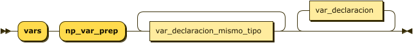

**programa:**


```
programa ::= 'program' 'np_program_start' 'id' 'np_start_dirfunc' ';' var_declaracion* func_definicion* 'main' '(' ')' '{' estatuto* '}'
```

**main:**


```
main     ::= 'main' 'np_prep_main' '(' ')' '{' loop_estatuto '}' 'np_fin_total'
```

**var_declaracion:**



```
var_declaracion
         ::= 'vars' 'np_var_prep' var_declaracion_mismo_tipo+ var_declaracion*
```

referenced by:

* programa
* var_declaracion

**var_declaracion_mismo_tipo:**


```
var_declaracion_mismo_tipo
         ::= tipo 'np_set_curr_var_type' 'id' 'np_set_curr_var_name' array_opcional? 'np_add_var_to_varstable' ';'
```

referenced by:

* var_declaracion

**array_opcional:**


```
array_opcional
         ::= '[' 'VAL_INT' 'np_push_const_int' ']'
```

referenced by:

* var_declaracion_mismo_tipo

**func_programa_loop:**


```
func_programa_loop
         ::= ( func_definicion func_programa_loop )*
```

referenced by:

* func_programa_loop

**func_definicion:**


```
func_definicion
         ::= 'function' ( tipo | 'void' ) 'np_func_tipo_retorno' 'id' 'np_func_id' 'np_add_to_func_dir' '(' 'np_prep_func_params'
                  parametro* ')' ';' 'var_declaracion'* 'np_save_curr_func_quad' '{' 'loop_estatuto' '}' 'np_kill_func'
```

referenced by:

* func_programa_loop
* programa

**parametro:**


```
parametro
         ::= tipo 'id' 'np_add_param' ( ',' 'id' 'np_add_param' )*
```

referenced by:

* func_definicion

**tipo:**


```
tipo     ::= 'int'
           | 'float'
           | 'char'
           | 'bool'
```

referenced by:

* func_definicion
* parametro
* var_declaracion_mismo_tipo

**estatuto:**


```
estatuto ::= asignacion
           | func_llamada ';'
           | func_return
           | read
           | write
           | decision
           | repeticion
```

referenced by:

* condicional
* decision
* no_condicional
* programa

**asignacion:**


```
asignacion
         ::= variable '=' hyper_exp ';'
```

referenced by:

* estatuto

**func_llamada:**


```
func_llamada
         ::= 'id' 'np_fc_1' '(' np_push_operator_stack ( hyper_exp 'np_fc_2' ( ',' hyper_exp 'np_fc_2' )* )? ')' 'np_pop_operator_stack' 'np_fc_3'
```

referenced by:

* estatuto
* factor

**func_retorno:**


```
func_retorno
         ::= 'return' '(' hyper_exp ')' ';' 'np_fr'
```

**read:**


```
read     ::= 'read' '(' variable 'np_add_to_input_counter' ( ',' variable 'np_add_to_input_counter' )* ')' ';' 'np_read'
```

referenced by:

* estatuto
* factor

**write:**


```
write    ::= 'write' '(' hyper_exp 'np_add_to_input_counter' ( ',' hyper_exp 'np_add_to_input_counter' )* ')' ';' 'np_write'
```

referenced by:

* estatuto

**decision:**


```
decision ::= 'if' '(' hyper_exp ')' 'np_decision_1' 'then' '{' estatuto* '}' ( 'else' np_decision_2 '{' estatuto* '}' )? 'np_dec_3'
```

referenced by:

* estatuto

**repeticion:**


```
repeticion
         ::= condicional
           | no_condicional
```

referenced by:

* estatuto

**condicional:**


```
condicional
         ::= 'while' 'np_cond_1' '(' hyper_exp ')' 'np_cond_2' 'do' '{' estatuto* '}' 'np_cond_3'
```

referenced by:

* repeticion

**no_condicional:**


```
no_condicional
         ::= 'for' variable '=' hyper_exp 'np_for_1' 'to' hyper_exp 'np_for_2' 'do' 'np_for_3' '{' ( estatuto ';' )* '}' 'np_for_4'
```

referenced by:

* repeticion

**hyper_exp:**


```
hyper_exp
         ::= super_exp ( ( '&' | '|' ) 'np_push_operator_stack' super_exp )? 'np_hyper_exp'
```

referenced by:

* asignacion
* condicional
* decision
* factor
* fm_1_param
* fm_2_param
* func_llamada
* func_retorno
* no_condicional
* write

**super_exp:**


```
super_exp
         ::= exp ( ( '>' | '<' | '==' | '!=' ) 'np_push_operator_stack exp' )? 'np_super_exp'
```

referenced by:

* hyper_exp

**exp:**


```
exp      ::= term ( ( '+' | '-' ) 'np_push_operator_stack' term )? 'np_exp'
```

referenced by:

* super_exp

**term:**


```
term     ::= factor ( ( '*' | '/' ) 'np_push_operator_stack' factor )? 'np_term'
```

referenced by:

* exp

**factor:**


```
factor   ::= func_llamada
           | variable
           | constant
           | read
           | func_mat
           | '(' hyper_exp ')'
```

referenced by:

* term

**constant:**


```
constant ::= VAL_INT 'np_push_const_int'
           | VAL_float 'np_push_const_float'
           | VAL_char 'np_push_const_char'
```

referenced by:

* factor

**func_mat:**


```
func_mat ::= fm_1_param
           | fm_2_param
```

referenced by:

* factor

**fm_1_param:**


```
fm_1_param
         ::= ( 'media' | 'mediana' | 'moda' | 'varianza' | 'len' ) '(' 'id' ')' 'np_arr_input'
           | ( 'sen' | 'cos' | 'tan' | 'senh' | 'cosh' | 'tanh' | 'log' | 'abs' |
                  'floor' | 'ceil' ) '(' hyper_exp ')' 'np_he_input'
```

referenced by:

* func_mat

**fm_2_param:**


```
fm_2_param
         ::= ( ( 'rand' | 'pow' ) '(' hyper_exp ',' hyper_exp ')' 'np_int_input' | ( 'min' | 'max' ) '(' hyper_exp ',' hyper_exp ')' 'np_same_input' )?
```

referenced by:

* func_mat

## 
 <sup>generated by [RR - Railroad Diagram Generator][RR]</sup>

[RR]: http://bottlecaps.de/rr/ui