**programa:**

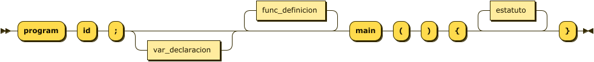

```
programa ::= 'program' 'id' ';' var_declaracion? func_definicion* 'main' '(' ')' '{' estatuto* '}'
```

**var_declaracion:**

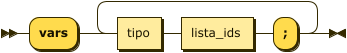

```
var_declaracion
         ::= 'vars' ( tipo lista_ids ';' )+
```

referenced by:

* func_definicion
* programa

**tipo:**

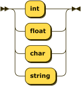

```
tipo     ::= 'int'
           | 'float'
           | 'char'
           | 'string'
```

referenced by:

* func_definicion
* parametro
* var_declaracion

**lista_ids:**

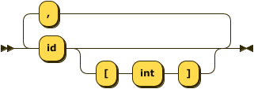

```
lista_ids
         ::= 'id' ( '[' 'int' ']' )? ( ',' 'id' ( '[' 'int' ']' )? )*
```

referenced by:

* var_declaracion

**func_definicion:**

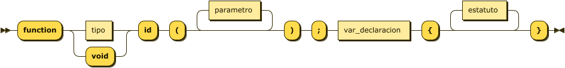

```
func_definicion
         ::= 'function' ( tipo | 'void' ) 'id' '(' parametro* ')' ';' var_declaracion '{' estatuto* '}'
```

referenced by:

* programa

**parametro:**

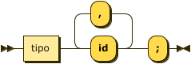

```
parametro
         ::= tipo 'id' ( ',' 'id' )* ';'
```

referenced by:

* func_definicion

**estatuto:**

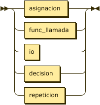

```
estatuto ::= asignacion
           | func_llamada
           | io
           | decision
           | repeticion
```

referenced by:

* condicional
* decision
* func_definicion
* no_condicional
* programa

**asignacion:**


```
asignacion
         ::= 'id' ( '[' expresion ']' )? '=' expresion
```

referenced by:

* estatuto

**expresion:**

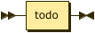

```
expresion
         ::= todo
```

referenced by:

* asignacion

**hyper_exp:**


```
hyper_exp
         ::= todo
```

referenced by:

* condicional
* decision
* func_llamada
* func_retorno
* no_condicional
* write

**func_llamada:**


```
func_llamada
         ::= 'id' '(' ( hyper_exp ( ',' hyper_exp )* )? ')'
```

referenced by:

* estatuto

**func_retorno:**

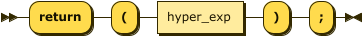

```
func_retorno
         ::= 'return' '(' hyper_exp ')' ';'
```

**io:**

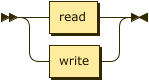

```
io       ::= read
           | write
```

referenced by:

* estatuto

**read:**


```
read     ::= 'read' '(' id ( ',' 'id' )* ')'
```

referenced by:

* io

**write:**


```
write    ::= 'write' '(' ( 'string' | hyper_exp ) ( ',' ( 'string' | hyper_exp ) )* ')'
```

referenced by:

* io

**decision:**


```
decision ::= 'if' '(' hyper_exp ')' 'then' '{' ( estatuto ';' )* '}' ( 'else' '{' ( estatuto ';' )* '}' )?
```

referenced by:

* estatuto

**repeticion:**

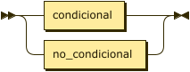

```
repeticion
         ::= condicional
           | no_condicional
```

referenced by:

* estatuto

**condicional:**


```
condicional
         ::= 'while' '(' hyper_exp ')' 'do' '{' ( estatuto ';' )* '}'
```

referenced by:

* repeticion

**no_condicional:**


```
no_condicional
         ::= 'for' 'id' '=' hyper_exp 'to' hyper_exp 'do' '{' ( estatuto ';' )* '}'
```

referenced by:

* repeticion

## 
 <sup>generated by [RR - Railroad Diagram Generator][RR]</sup>

[RR]: http://bottlecaps.de/rr/ui

**factor:**

```
factor   ::= func_llamada
           | variable
           | 'bool_value'
           | 'string_value'
           | 'int_value'
           | 'float_vallue'
           | '(' hyper_exp ')'
```

