**variable:**

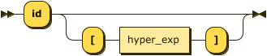

```
variable ::= 'id' ( '[' hyper_exp ']' )?
```

referenced by:

* asignacion
* no_condicional
* read

**asignacion:**

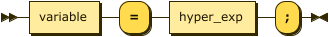

```
asignacion
         ::= variable '=' hyper_exp ';'
```

**read:**

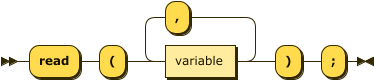

```
read     ::= 'read' '(' variable ( ',' variable )* ')' ';'
```

**write:**

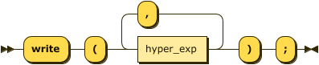

```
write    ::= 'write' '(' hyper_exp ( ',' hyper_exp )* ')' ';'
```

**decision:**

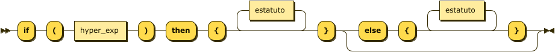

```
decision ::= 'if' '(' hyper_exp ')' 'then' '{' estatuto* '}' ( 'else' '{' estatuto* '}' )?
```

**condicional:**

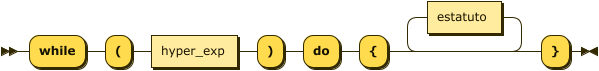

```
condicional
         ::= 'while' '(' hyper_exp ')' 'do' '{' estatuto* '}'
```

**no_condicional:**

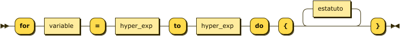

```
no_condicional
         ::= 'for' variable '=' hyper_exp 'to' hyper_exp 'do' '{' ( estatuto ';' )* '}'
```

**func_llamada:**

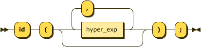

```
func_llamada
         ::= 'id' '(' ( hyper_exp ( ',' hyper_exp )* )? ')' ';'
```

**hyper_exp:**

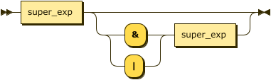

```
hyper_exp
         ::= super_exp ( ( '&' | '|' ) super_exp )?
```

referenced by:

* asignacion
* condicional
* decision
* func_llamada
* no_condicional
* variable
* write

**super_exp:**

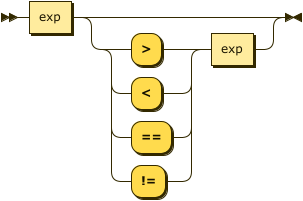

```
super_exp
         ::= exp ( ( '>' | '<' | '==' | '!=' ) exp )?
```

referenced by:

* hyper_exp

**exp:**


```
exp      ::= term ( ( '+' | '-' ) term )?
```

referenced by:

* super_exp

**term:**

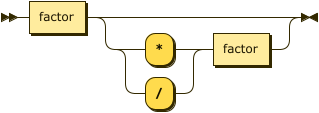

```
term     ::= factor ( ( '*' | '/' ) factor )?
```

referenced by:

* exp

## 
 <sup>generated by [RR - Railroad Diagram Generator][RR]</sup>

[RR]: http://bottlecaps.de/rr/ui